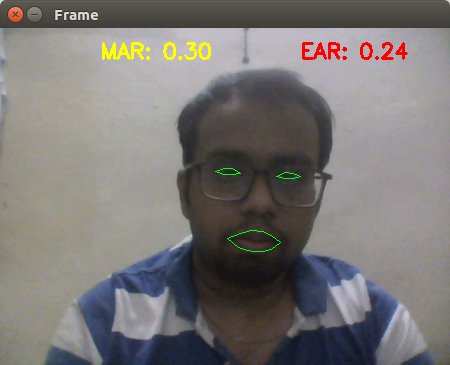

# Driver-Alertness-Detection
This is a project which aims to help the drivers to stay alert on road without using any external hardware. Thus providing a cost effective safety application for drivers on road preventing car accidents.
## Introduction

Drowsy driving is a major problem in the world. The risk, danger, and often tragic results of drowsy driving are alarming. Drowsy driving is the dangerous combination of driving and sleepiness or fatigue. This usually happens when a driver has not slept enough, but it can also happen because of untreated sleep disorders, medications, drinking alcohol, or shift work.

No one knows the exact moment when sleep comes over their body. Falling asleep at the wheel is clearly dangerous, but being sleepy affects your ability to drive safely even if you don’t fall asleep. Drowsiness—

    -Makes you less able to pay attention to the road.
    -Slows reaction time if you have to brake or steer suddenly.
    -Affects your ability to make good decisions.
## Facts
- As per road safety experts’ recommendations, drivers should not drive continuously for more than three hours without a break of 15 to 30 minutes.
- Exhausted drivers who doze off at the wheel are responsible for about 40% of road accidents, says a study by the Central Road Research Institute (CRRI) on the 300-km Agra-Lucknow Expressway.
- According to the latest data released by road transport and highways minister Nitin Gadkari, 1,47,913 people were killed in road accidents in 2017, with Uttar Pradesh reporting the maximum number of 20,124 road accident fatalities, followed by Tamil Nadu with 16,157 deaths.
## Some warning signs of Drowsy Driving
- Yawning or blinking frequently
- Drifting from your lane
- Missing Your Exit
## Project Introduction

 This projects helps to alert the drivers in case of drowsiness. The project uses image processing as a tool in order to prevent it. We used the fact that while driving the driver may yawn or blink frequently. In that case we use the aspect ratio of both eyes and the mouth region using the shape_predictor_68_face_landmarks.dat. By calculating the aspect ratio in our region of interest and specifying a particular ratio we define whether the driver is drowsy or not. Upon detecting of drowsiness the alarm alerts the driver.

## <h2>Using the Project</h2>
- Clone the repository 
- Download the shape_predictor_68_face_landmarks.dat
- Run main.py

## Screenshots

 Here are some outputs for the project:

<h3>Input 1</h3>                                                                            

### Output 1 

### Input 2

### Output 2 

### Input 3 

### Output 3 

